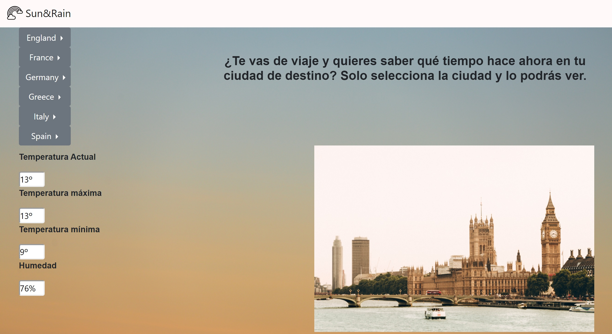

# **Sun&Rain**  

## **Title**: 
Consulta tiempo de hoy de la ciudad que desees

## **Descripcion**:
#### How does it work?
Gracias a nuestra aplicación tendras una lista de paises en los cuales puedes seleccionar la ciudad a la que quieres hacer la consulta. Al hacer click te mostrará los siguientes datos:
*  Temperatura Actual
*  Temperatura máxima
*  Temperatura mínima
*  Humedad

Adicionalmente, al seleccionar una ciudad te mostrará una imagen de ella para hacer más atractiva la web.
## **How to use**:
Debes ir https://github.com/ y clonar ana-atf/ejercicio3_Ajax

## **Future improvements**:
*  Añadir geolocalización
*  Realizar version movil
*  Añadir el listado de paises en el Navbar para reorganizar los elementos de la página, con esto se eliminará scroll y la haremos más atractiva
*  Cambiar input por div con background blanco

## **Legal terms**:
Tenemos esta licencia **GNU AFFERO GENERAL PUBLIC LICENSE**

